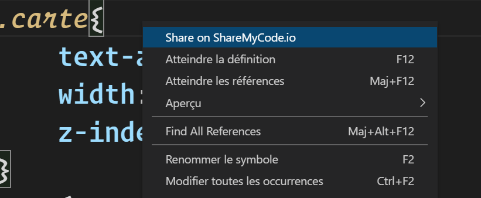
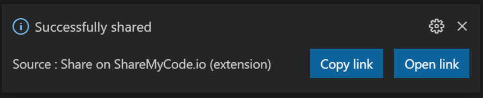

# share-on-sharemycode-io README

This extensions adds a context menu option that allows you to share selected snippet or the whole page on https://sharemycode.io website.

## Features

Just right click on the document or on the selection and select "Share on ShareMyCode.io"

As soon as the code is shared, you get a notification with a link to the share

## Release Notes

### 1.0.0

Initial release of Share on ShareMyCode.io

### 1.0.1

Small cosmetic edit

### 1.0.2

Edited README

### 1.0.3

Added copy button

**Enjoy!**